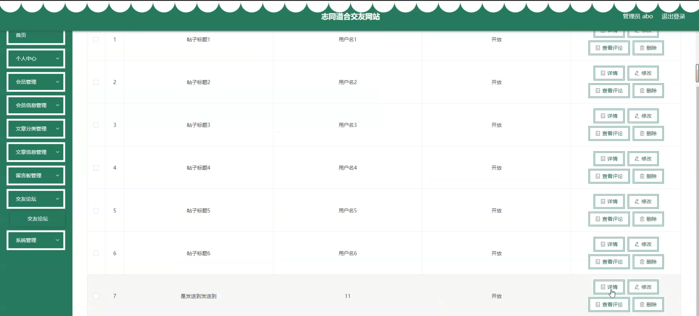

# 基于springboot的志同道合交友网站的毕业设计轻松解决毕业难题

#### 介绍

如何快速的完成毕业设计并顺利毕业呢？基于Spring Boot的志同道合交友网站旨在为用户提供一个安全、便捷的平台，让有相同兴趣爱好的人们可以相识、交流、建立友谊。该系统设计了两种角色：管理员和会员。每个角色拥有不同的功能模块，以确保系统的高效运行和良好的用户体验。

#### 研究背景

当前社会各行业领域竞争压力非常大，随着当前时代的信息化，科学化发展，让社会各行业领域都争相使用新的信息技术，对行业内的各种相关数据进行科学化，规范化管理。这样的大环境让那些止步不前，不接受信息改革带来的信息技术的企业随时面临被淘汰，被取代的风险。所以当今，各个行业领域，不管是传统的教育行业，餐饮行业，还是旅游行业，医疗行业等领域都将使用新的信息技术进行信息革命，改变传统的纸质化，需要人手工处理工作事务的办公环境。软件信息技术能够覆盖社会各行业领域是时代的发展要求，各种数据以及文件真正实现电子化是信息社会发展的不可逆转的必然趋势。本志同道合交友网站也是紧跟科学技术的发展，运用当今一流的软件技术实现软件系统的开发，让家具销售库存管理信息完全通过管理系统实现科学化，规范化，程序化管理。从而帮助信息使用者节省事务处理的时间，降低数据处理的错误率，对于基础数据的管理水平可以起到促进作用，也从一定程度上对随意的业务管理工作进行了避免，同时，志同道合交友网站的数据库里面存储的各种动态信息，也为上层管理人员作出重大决策提供了大量的事实依据。总之，志同道合交友网站是一款可以真正提升使用者的使用效率的软件系统。

#### 技术栈

后端技术栈：Springboot+Mysql+Maven

前端技术栈：Vue+Html+Css+Javascript+ElementUI

开发工具：Idea+Vscode+Navicate

#### 系统功能介绍

管理员角色功能模块  
个人中心：管理个人信息，修改密码，查看通知和系统消息。  
会员管理：查看和管理系统注册会员，审核会员申请，分配会员权限。  
会员信息管理：查看、编辑、删除会员信息，确保会员信息的准确性和完整性。  
文章分类管理：管理文章分类，添加、编辑、删除分类，确保文章分类的合理性。  
文章信息管理：查看、编辑、删除文章信息，管理文章的发布和审核。  
留言板管理：查看和管理留言板信息，处理用户留言和反馈，维护良好的用户互动。  
交友论坛：管理论坛版块，审核帖子，维护论坛秩序，确保论坛的健康发展。  
系统管理：管理系统设置，配置网站公告，维护系统正常运行。  

会员角色功能模块  
会员信息：查看和编辑个人信息，管理个人资料，提升个人资料的完整性和吸引力。  
文章信息：浏览和发布文章，支持文章分类和标签，提升文章的搜索和展示效果。  
交友论坛：参与论坛讨论，发布和回复帖子，结识志同道合的朋友。  
网站公告：查看网站公告和系统通知，了解最新的系统动态和重要信息。  
留言板：发布留言和反馈，参与留言互动，增强与其他会员和管理员的交流。  
个人中心：管理个人信息，修改密码，查看个人通知和系统消息。  
后台管理中的会员信息管理：查看和编辑个人信息，管理个人资料。  
后台管理中的文章信息管理：查看和管理个人发布的文章，编辑和删除文章，查看文章的浏览量和评论情况。  

#### 系统功能结构设计

在分析并得出使用者对程序的功能要求时，就可以进行程序设计了。

#### 系统流程分析

操作流程分析

程序上交给用户进行使用时，需要提供程序的操作流程图，这样便于用户容易理解程序的具体工作步骤，现如今程序的操作流程都有一个大致的标准，即先通过登录页面提交登录数据，通过程序验证正确之后，用户才能在程序功能操作区页面操作对应的功能。

登录流程分析

在这个部分，需要对程序的登录功能模块的运行流程，进行单独说明。程序设置登录模块也是为了安全起见，让用户使用放心，登录模块主要就是让用户提交登录信息，程序进行数据验证，验证通过的用户才能够成功登录程序。

信息添加流程分析

程序的添加功能就是提供给操作者录入信息的功能，不管是涉及到用户信息添加，还是其它功能模块涉及到的信息添加，程序的信息添加流程都是一致的。程序都是先对操作者录入的数据进行判定，这个判定规则是一段提前编写完成的程序代码，当程序判定数据符合要求时，才会把操作者录入的数据登记在数据表里面，比如添加的用户信息，就会把新添加的用户信息写入用户信息的数据表文件里面。

信息删除流程分析

当从程序里面删除某种无效数据时，遵循程序的信息删除流程，先要选中操作者需要删除的数据，程序为了预防操作者误删信息，也会进行提示，当操作者真正确定要删选中的信息时，该信息就会从数据库中被永久删除。

#### 系统作用

兴趣交流：为有相同兴趣爱好的用户提供一个交流的平台，促进用户之间的互动和交流。  
内容分享：会员可以在平台上分享文章，发布有关兴趣爱好的内容，提升内容的多样性和丰富性。  
会员管理：管理员可以有效地管理系统会员，维护会员信息的准确性和系统的安全性。  
互动平台：提供留言板和论坛功能，增强用户之间的互动，提高用户粘性和活跃度。  
系统安全：通过管理员的有效管理，确保系统的安全性和信息的真实性，提供一个可信赖的平台。  

#### 系统功能截图

登录

会员信息模块

交友论坛

个人中心

会员端后台管理

文章端信息管理

管理员端文章分类管理

交友论坛

系统管理

#### 总结

基于Spring Boot的志同道合交友网站不仅为用户提供了一个交流兴趣爱好、结识新朋友的平台，也为自媒体人提供了一个分享和发布内容的渠道。通过管理员的有效管理，系统确保了信息的安全性和真实性。该系统的开发不仅填补了现有交友平台功能单一的空白，也为未来的交友平台发展提供了新的思路和方向。通过不断优化和升级，本系统有望在社交领域中发挥更大的作用和影响力。

#### 使用说明

创建数据库，执行数据库脚本 修改jdbc数据库连接参数 下载安装maven依赖jar 启动idea中的springboot项目

后台地址
http://localhost:8080/springboot2x7r5/admin/dist/index.html

管理员  abo 密码 abo

前台地址：http://localhost:8080/springboot2x7r5/front/index.html

